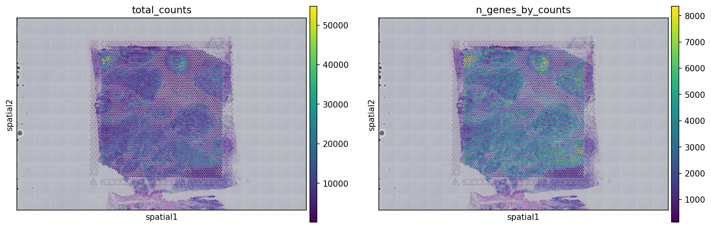
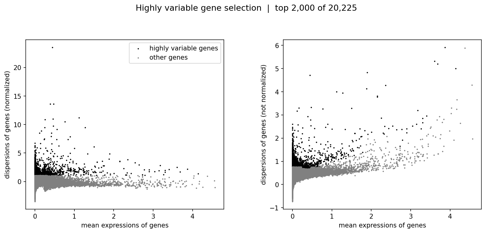
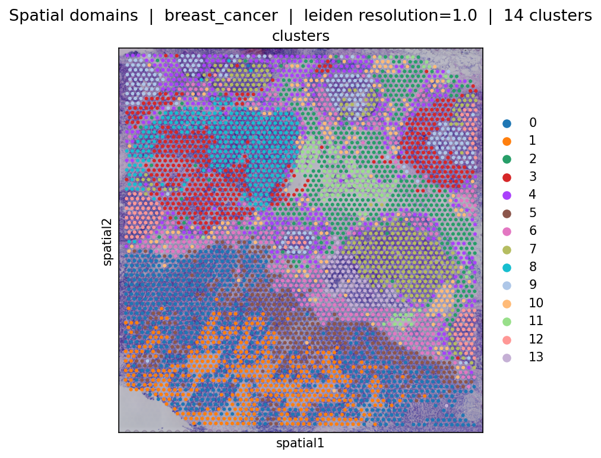
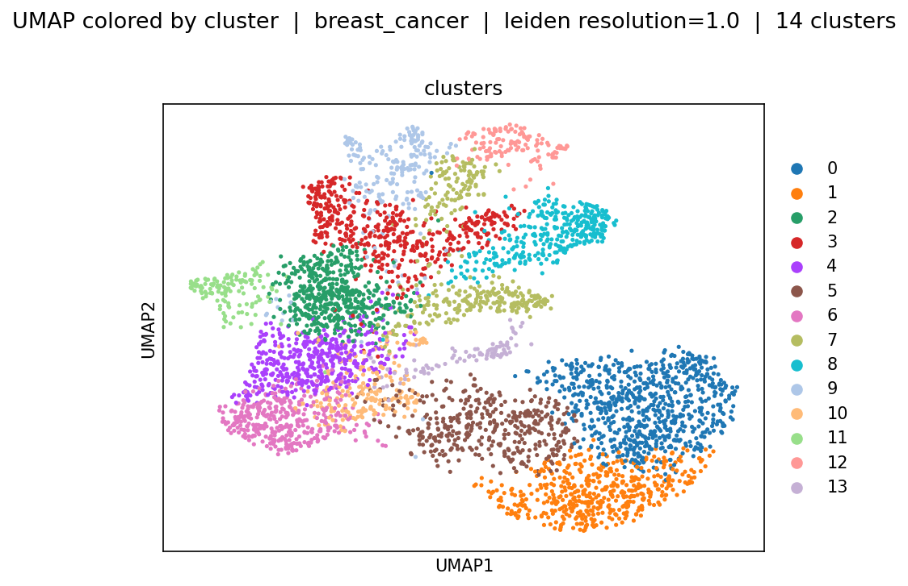
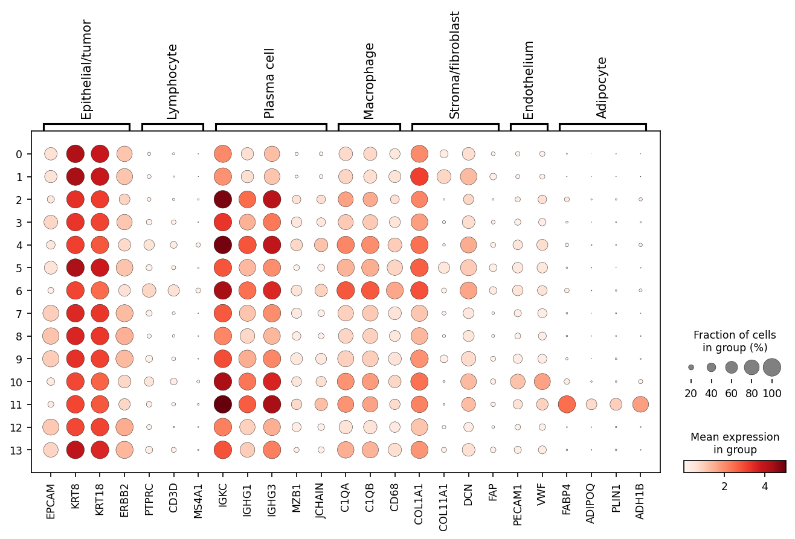

# spatial-transcriptomics

[日本語](#日本語) | [English](#english)

---

## 日本語

10x Genomics Visium（ヒト乳がん組織・Fresh Frozen）の空間トランスクリプトミクス解析プロジェクトである。

- **何を**: 乳がん組織切片の Visium 空間トランスクリプトームデータに対して、QC・正規化・次元削減・クラスタリング・マーカー遺伝子（DEG）探索・空間的な細胞間相互作用解析までを一貫して行うパイプラインを実装している。
- **どのデータで**: 10x Genomics が公開している Human Breast Cancer（Visium, Fresh Frozen, Whole Transcriptome）データセットを使用する（詳細は [データソース](#データソース) を参照）。
- **何を明らかにするか**: 組織内の遺伝子発現に基づくクラスター（腫瘍領域・間質領域など）を同定し、それらの空間的な分布パターンやクラスター間の近接・相互作用を可視化・定量することを目指す。
- 実装は `scanpy` / `squidpy` をベースに、`config/config.yaml` による設定管理と `src/` 以下の再利用可能なモジュールで構成する（ロジックを `.ipynb` に直書きしない方針、詳細は [CLAUDE.md](./CLAUDE.md) を参照）。

### 解析結果

パイプラインは `scripts/run_qc.py` → `run_preprocess.py` → `run_clustering.py` → `run_markers.py` の順に実行し、各段階の出力を `results/<段階>/` に置いている。パラメータは [config/config.yaml](./config/config.yaml) を参照。

**1. QC** — スポットごとの総 UMI 数と検出遺伝子数を組織像に重ねて確認し、検出遺伝子数 500 未満・ミトコンドリア由来 UMI 割合 12% 超のスポットを除外した。



**2. 正規化・特徴量選択** — total-count 正規化（10,000）と log1p の後、高変動遺伝子 2,000 を選択した。



**3. クラスタリング** — PCA（50 成分）→ 近傍グラフ（k=15）→ UMAP を経て、Leiden（resolution 1.0）で 4,825 スポットを 14 クラスタに分けた。各クラスタは組織像上で空間的にまとまった領域として現れる。Squidpy の空間近傍グラフで計算したモラン I の上位は ISG15, C1QA, C1QB, CD52, C1QC（[moran_top_genes.csv](results/clustering/moran_top_genes.csv)）。





**4. マーカー遺伝子による空間ドメインの解釈** — 既知マーカー（上皮/腫瘍、リンパ球、形質細胞、マクロファージ、間質、内皮、脂肪）の発現スコアで各クラスタに系譜を割り当てた（[cluster_annotation.csv](results/markers/cluster_annotation.csv)）。上皮/腫瘍が 7 クラスタ（0, 5, 7, 8, 9, 12, 13）、形質細胞 3（2, 3, 4）、間質 1、リンパ球 1、内皮 1、脂肪 1。信頼度 low のクラスタ（3, 4, 5, 6）は複数系譜のスコアが拮抗しており、腫瘍と免疫細胞が混在する領域と考えられる。



### 現状と今後

- 実装済み: QC → 正規化・HVG → 次元削減・クラスタリング → 空間自己相関 → マーカー遺伝子による解釈
- 未着手: クラスタ間の近傍出現頻度・共起解析（`src/interaction.py` は実装済み、結果は未出力）、テスト

### ディレクトリ構成

```
config/           # 設定ファイル（パスやパラメータなど）
data/             # データ関連フォルダ（.gitignore 対象。下記「データソース」参照）
├─ processed/     # 前処理後のデータ
└─ raw/           # 生データ
    └─ breast_cancer/
        ├─ Visium_Human_Breast_Cancer_filtered_feature_bc_matrix.h5   # Space Ranger 出力 H5 ファイル
        └─ spatial/                                                   # 空間座標・画像情報など
notebooks/        # 解析用の Jupyter ノートブック（ロジックは src/ から import して使う）
results/          # 解析結果（グラフ、表、レポートなど）
scripts/          # 実行用スクリプト（バッチ処理や再現用スクリプト）
src/              # 解析用の Python コード（再利用可能な関数・dataclass パラメータ）
```

### データソース

- **名称**: Human Breast Cancer（Visium, Fresh Frozen, Whole Transcriptome）
- **URL**: https://www.10xgenomics.com/jp/datasets/human-breast-cancer-visium-fresh-frozen-whole-transcriptome-1-standard
- **取得日**: 2026-03
- **ライセンス**: 10x Genomics が公開する Datasets の利用規約に準拠する。再配布・商用利用の可否を含む正確な条件は、上記 URL のページに記載された Terms of Use を参照すること。本リポジトリはデータそのものを再配布しない。
- **保管先**: ローカルの `data/raw/`。生データと中間生成物（`.h5ad`）はリポジトリに含めず、図と表のみ `results/` に置く。
- **備考**: Space Ranger 出力一式のうち、Python 解析で使うのは主に `filtered_feature_bc_matrix/`（または `.h5`）と `spatial/` である。H&E 画像（`.tif`）は重ね合わせ表示用、`.cloupe` は Loupe Browser 専用で Python 解析では使わない。詳細は [CLAUDE.md](./CLAUDE.md) のファイル一覧を参照すること。

#### `data/` の取得手順

`data/` は `.gitignore` 対象のため、このリポジトリには含まれない（GitHub Actions のランナー上にも存在しない）。解析を再現するには、以下の手順でローカルにデータを配置する。

1. 上記 URL から Space Ranger 出力一式（`filtered_feature_bc_matrix.h5` または `filtered_feature_bc_matrix/`、`spatial/` を含む）をダウンロードする。
2. `data/raw/<sample_id>/` （例: `data/raw/breast_cancer/`）以下に、ダウンロードしたファイル・フォルダをそのまま配置する。
3. `config/config.yaml` の `inputs.sample_id`（または `inputs.spaceranger_out_dir`）に配置先のディレクトリ名を設定する。

```yaml
inputs:
  sample_id: "breast_cancer"   # data/raw/breast_cancer を参照する場合
```

### セットアップ（uv）

依存管理には [uv](https://docs.astral.sh/uv/) を使用する。システム Python には install しない。

```bash
# 1. 依存関係のインストール
uv sync

# 2. データの配置（前節「data/ の取得手順」を参照）

# 3. パイプラインの実行
uv run python -c "
from pathlib import Path
from src.pipeline import run_pipeline
run_pipeline(Path('.'))
"
```

ノートブックで対話的に確認する場合:

```bash
uv run jupyter lab
# notebooks/visium_pipeline.ipynb を開く
```

パラメータ（QC 閾値・クラスタリング解像度など）は `config/config.yaml` と `src/` 各モジュールの dataclass（`PreprocessParams` / `DimReduceParams` / `ClusteringParams` 等）で管理する。コードへの直書きはしない。

#### 依存関係についての方針

- `pyyaml` / `leidenalg` / `squidpy` はいずれも `pyproject.toml` に宣言済みで、`uv.lock` に固定されている。
- 空間データの読み込みと可視化には **squidpy** を使う（`sq.read.visium` / `sq.pl.spatial_scatter`）。scanpy の `sc.read_visium` / `sc.pl.spatial` は squidpy へ移管され将来削除されるため、新規コードでは使わない。
- 詳細は [CLAUDE.md](./CLAUDE.md) を参照すること。

### `src/` モジュール一覧

| モジュール | 役割 |
| --- | --- |
| `src/preprocessing.py` | Visium データの読み込み（`sq.read.visium`）、QC メトリクス付与、セル/遺伝子フィルタ、正規化・log1p・高変動遺伝子（HVG）選択 |
| `src/clustering.py` | PCA → 近傍グラフ → UMAP による次元削減、Leiden/Louvain クラスタリング、Squidpy による空間近傍グラフ構築とモランI（空間自己相関）計算 |
| `src/deg.py` | `sc.tl.rank_genes_groups` をラップしたマーカー遺伝子・DEG（差次的発現）解析 |
| `src/visualization.py` | QC violin plot、UMAP、空間プロット（Visium 重ね合わせ表示）の可視化ヘルパー |
| `src/interaction.py` | Squidpy によるクラスター間の近傍出現頻度（neighborhood enrichment）・共起（co-occurrence）解析と可視化 |
| `src/pipeline.py` | `config/config.yaml` の設定に基づき、前処理〜次元削減〜クラスタリング〜（任意で）空間解析〜結果出力までを実行する統合パイプライン（`run_pipeline`） |
| `config/__init__.py` | `config/config.yaml` の読み込みとパス・パラメータ解決のユーティリティ（`load_config` / `get_paths`） |

### Docker（Python + Jupyter）

このリポジトリには、解析環境を再現するための `Dockerfile` が含まれる。`uv` によるローカル実行の代替手段である。解析は Python のみで完結するため、イメージは `python:3.11-slim` をベースにしている。

Python の依存関係は、Dockerfile に手書きのパッケージ一覧を持たず、`pyproject.toml` / `uv.lock` から `uv sync --frozen` で入れる。そのため `pyproject.toml` に依存を追加・変更した際、Dockerfile を編集しなくてもイメージに反映される。`jupyterlab` は解析本体には不要なため `pyproject.toml` の `notebook` optional dependency として宣言し、Dockerfile 側で `--extra notebook` を付けて入れている。

#### ビルド

```bash
# プロジェクトルートで実行
docker build -t spatial-transcriptomics .
```

#### 起動（ノートブック実行）

```bash
docker run --rm -p 8888:8888 -v "$PWD":/work spatial-transcriptomics
```

起動ログに表示される **token 付き URL** をブラウザで開く。

`docker run` は `-v "$PWD":/work` でカレントディレクトリを `/work` に上書きマウントするため、イメージに `COPY` されたソースはローカルの変更で置き換わる（依存関係はイメージ内の venv を使い続ける）。

### ライセンス

このリポジトリのコードは [MIT License](./LICENSE) のもとで公開している。データセット自体のライセンスは [データソース](#データソース) 節を参照すること（コードのライセンスとは別である）。

### メモ

- `data/` と `results/` は `.dockerignore` でビルドコンテキストから除外している（ビルド高速化のため）。

---

## English

A spatial transcriptomics analysis project using 10x Genomics Visium data (human breast cancer tissue, fresh frozen).

- **What**: Implements an end-to-end pipeline over Visium spatial transcriptome data from breast cancer tissue sections — QC, normalization, dimensionality reduction, clustering, marker gene (DEG) discovery, and spatial cell-cell interaction analysis.
- **What data**: Uses the publicly available Human Breast Cancer (Visium, Fresh Frozen, Whole Transcriptome) dataset from 10x Genomics (see [Data Source](#data-source) for details).
- **Goal**: Identify expression-based clusters within the tissue (e.g. tumor regions, stromal regions), and visualize/quantify their spatial distribution patterns and inter-cluster proximity/interactions.
- Built on `scanpy` / `squidpy`, with configuration managed via `config/config.yaml` and reusable modules under `src/` (logic is not written directly in `.ipynb` files — see [CLAUDE.md](./CLAUDE.md) for details).

### Results

The pipeline runs `scripts/run_qc.py` → `run_preprocess.py` → `run_clustering.py` → `run_markers.py`, writing each stage's outputs to `results/<stage>/`. Parameters are in [config/config.yaml](./config/config.yaml).

**1. QC** — Total UMI counts and detected genes per spot were inspected over the tissue image; spots with fewer than 500 detected genes or more than 12% mitochondrial UMIs were removed.


**2. Normalization and feature selection** — Total-count normalization (10,000) and log1p, followed by selection of 2,000 highly variable genes.


**3. Clustering** — PCA (50 components) → neighbor graph (k=15) → UMAP, then Leiden (resolution 1.0) partitioned 4,825 spots into 14 clusters, which appear as spatially coherent regions on the tissue. Top genes by Moran's I on the Squidpy spatial neighbor graph: ISG15, C1QA, C1QB, CD52, C1QC ([moran_top_genes.csv](results/clustering/moran_top_genes.csv)).


**4. Interpreting spatial domains with marker genes** — Each cluster was assigned a lineage by scoring known markers (epithelial/tumor, lymphocyte, plasma cell, macrophage, stroma, endothelium, adipocyte) ([cluster_annotation.csv](results/markers/cluster_annotation.csv)): 7 epithelial/tumor clusters (0, 5, 7, 8, 9, 12, 13), 3 plasma cell (2, 3, 4), and one each of stroma, lymphocyte, endothelium and adipocyte. Low-confidence clusters (3, 4, 5, 6) have competing lineage scores and likely represent regions where tumor and immune cells are intermixed.


### Status and Next Steps

- Implemented: QC → normalization/HVG → dimensionality reduction/clustering → spatial autocorrelation → marker-based interpretation
- Not yet: neighborhood enrichment / co-occurrence between clusters (`src/interaction.py` exists; no outputs yet), tests

### Directory Structure

```
config/           # Config files (paths, parameters, etc.)
data/             # Data folder (gitignored; see "Data Source" below)
├─ processed/     # Preprocessed data
└─ raw/           # Raw data
    └─ breast_cancer/
        ├─ Visium_Human_Breast_Cancer_filtered_feature_bc_matrix.h5   # Space Ranger output H5 file
        └─ spatial/                                                   # Spatial coordinates / image info, etc.
notebooks/        # Jupyter notebooks for analysis (imports logic from src/)
results/          # Analysis outputs (plots, tables, reports, etc.)
scripts/          # Executable scripts (batch jobs, reproduction scripts)
src/              # Python code for analysis (reusable functions / dataclass parameters)
```

### Data Source

- **Name**: Human Breast Cancer (Visium, Fresh Frozen, Whole Transcriptome)
- **URL**: https://www.10xgenomics.com/datasets/human-breast-cancer-visium-fresh-frozen-whole-transcriptome-1-standard
- **Retrieved on**: 2026-03
- **License**: Governed by the Terms of Use published on 10x Genomics' Datasets page. Refer to the Terms of Use at the URL above for the exact conditions, including redistribution and commercial use. This repository does not redistribute the data itself.
- **Storage**: Local `data/raw/`. Raw data and intermediate outputs (`.h5ad`) are not committed; only figures and tables are kept under `results/`.
- **Notes**: Of the full Space Ranger output, Python analysis mainly uses `filtered_feature_bc_matrix/` (or `.h5`) and `spatial/`. The H&E image (`.tif`) is used for overlay visualization, and `.cloupe` is for Loupe Browser only — it is not used in Python analysis. See the file list in [CLAUDE.md](./CLAUDE.md) for details.

#### Getting `data/`

`data/` is gitignored and is not included in this repository (nor does it exist on GitHub Actions runners). To reproduce the analysis, place the data locally following these steps:

1. Download the full Space Ranger output (`filtered_feature_bc_matrix.h5` or `filtered_feature_bc_matrix/`, including `spatial/`) from the URL above.
2. Place the downloaded files/folders as-is under `data/raw/<sample_id>/` (e.g. `data/raw/breast_cancer/`).
3. Set `inputs.sample_id` (or `inputs.spaceranger_out_dir`) in `config/config.yaml` to the destination directory name.

```yaml
inputs:
  sample_id: "breast_cancer"   # when referencing data/raw/breast_cancer
```

### Setup (uv)

Dependency management uses [uv](https://docs.astral.sh/uv/). Nothing is installed into the system Python.

```bash
# 1. Install dependencies
uv sync

# 2. Place the data (see "Getting data/" above)

# 3. Run the pipeline
uv run python -c "
from pathlib import Path
from src.pipeline import run_pipeline
run_pipeline(Path('.'))
"
```

To explore interactively via notebook:

```bash
uv run jupyter lab
# open notebooks/visium_pipeline.ipynb
```

Parameters (QC thresholds, clustering resolution, etc.) are managed via `config/config.yaml` and dataclasses in each `src/` module (`PreprocessParams` / `DimReduceParams` / `ClusteringParams`, etc.), not hardcoded.

#### Dependency Policy

- `pyyaml`, `leidenalg`, and `squidpy` are all declared in `pyproject.toml` and pinned in `uv.lock`.
- Spatial data loading and visualization go through **squidpy** (`sq.read.visium` / `sq.pl.spatial_scatter`). scanpy's `sc.read_visium` / `sc.pl.spatial` have been migrated to squidpy and are scheduled for removal, so they are not used in new code.
- See [CLAUDE.md](./CLAUDE.md) for details.

### `src/` Module Overview

| Module | Role |
| --- | --- |
| `src/preprocessing.py` | Loads Visium data (`sq.read.visium`), attaches QC metrics, filters cells/genes, normalizes, log1p, and selects highly variable genes (HVGs) |
| `src/clustering.py` | Dimensionality reduction via PCA → neighbor graph → UMAP, Leiden/Louvain clustering, spatial neighbor graph construction via Squidpy, and Moran's I (spatial autocorrelation) computation |
| `src/deg.py` | Marker gene / DEG (differential expression) analysis wrapping `sc.tl.rank_genes_groups` |
| `src/visualization.py` | Visualization helpers for QC violin plots, UMAP, and spatial plots (Visium overlay) |
| `src/interaction.py` | Neighborhood enrichment and co-occurrence analysis/visualization between clusters via Squidpy |
| `src/pipeline.py` | Integrated pipeline (`run_pipeline`) that runs preprocessing → dimensionality reduction → clustering → (optionally) spatial analysis → output, based on `config/config.yaml` |
| `config/__init__.py` | Utilities for loading `config/config.yaml` and resolving paths/parameters (`load_config` / `get_paths`) |

### Docker (Python + Jupyter)

This repository includes a `Dockerfile` that reproduces the analysis environment, as an alternative to running locally with `uv`. The analysis is pure Python, so the image is based on `python:3.11-slim`.

Python dependencies are not hand-listed in the Dockerfile; they are installed from `pyproject.toml` / `uv.lock` via `uv sync --frozen`. This means adding or changing a dependency in `pyproject.toml` is reflected in the image without editing the Dockerfile. `jupyterlab` is not needed for the analysis itself, so it is declared as the `notebook` optional dependency group in `pyproject.toml` and installed in the Dockerfile via `--extra notebook`.

#### Build

```bash
# run from the project root
docker build -t spatial-transcriptomics .
```

#### Run (launch notebook)

```bash
docker run --rm -p 8888:8888 -v "$PWD":/work spatial-transcriptomics
```

Open the **URL with the token** shown in the startup log in a browser.

`docker run` mounts the current directory over `/work` via `-v "$PWD":/work`, so the source copied into the image is overridden by the local checkout (dependencies still come from the venv baked into the image).

### License

The code in this repository is released under the [MIT License](./LICENSE). See the [Data Source](#data-source) section for the dataset's own license (separate from the code license).

### Notes

- `data/` and `results/` are excluded from the Docker build context via `.dockerignore` (to speed up builds).
